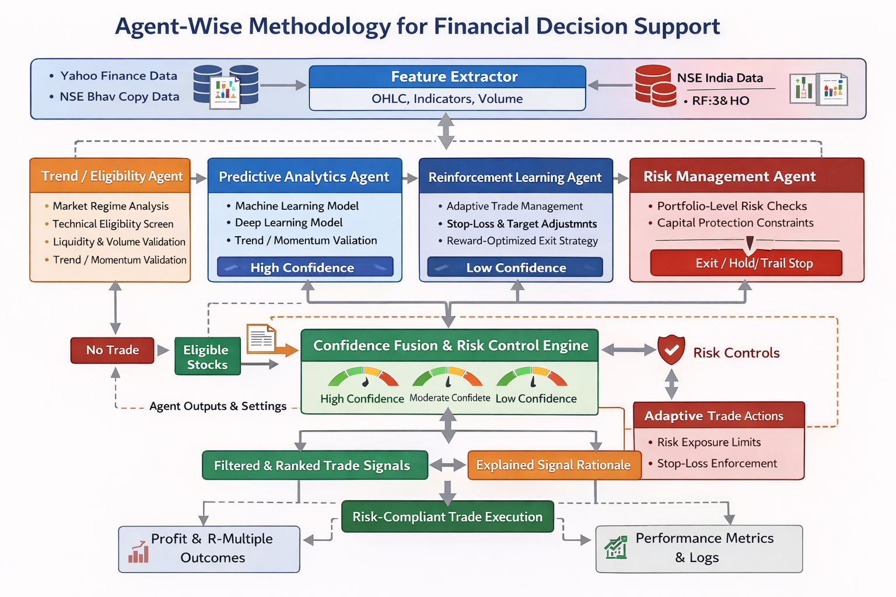

## I. INTRODUCTION

Financial markets have undergone a profound transformation driven by rapid technological advancements, zero-commission platforms, and real-time trading data. In the Indian equity market, increased retail participation has amplified the volume and volatility of daily trading. Modern markets function as complex, stochastic ecosystems heavily influenced by global macroeconomic variables, resulting in sudden regime shifts and unpredictable price dynamics. Traditional trading approaches relying on manual pattern recognition, emotional intuition, or static rule-based threshold systems (e.g., simple moving average crossovers) increasingly fail to adapt to these non-stationary environments.

Consequently, the financial industry has pivoted toward Artificial Intelligence (AI) and Machine Learning (ML) for systematic predictive modeling. Early algorithmic systems utilizing standalone classifiers—such as Random Forest, Gradient Boosting, and Support Vector Machines—demonstrated remarkable success in extracting signals from cross-sectional tabular data. However, these traditional models lacked the capacity to capture sequential behavioral patterns or complex temporal price evolutions critical for timing momentum breakouts. The advent of Deep Learning, particularly Long Short-Term Memory (LSTM) architectures, significantly improved the modeling of time-series dependencies. Yet, isolated predictive AI models present new operational challenges: they often function in a vacuum, focusing exclusively on directional accuracy while wholly neglecting post-entry trade management, optimal stop-loss placement, and dynamic portfolio discipline. Furthermore, unconstrained AI models function as opaque "black boxes," lacking the localized explainability necessary for traders to deploy capital confidently. This structural isolation frequently causes catastrophic drawdowns during unforeseen, asymmetric market anomalies, as models lack embedded logic to protect equity once a position is initiated.

To bridge the critical gap between predictive modeling and structured risk discipline, this research introduces an Intelligent Hybrid Multi-Agent Decision Support System (HMADSS) targeted specifically for momentum-based equity trading. Momentum trading relies on the empirically verified financial anomaly that assets exhibiting strong relative performance tend to continue appreciating in the near term. This strategy offers robust alpha generation capabilities but mathematically demands highly precise entry timing and stringent downside risk isolation. Inspired by professional institutional trading desks, the proposed framework decouples complex market analysis into a cohesive, six-layer multi-agent architecture integrating ML, Deep Learning, and Reinforcement Learning (RL):

1. **Market Trend Agent**: Operating as the macroeconomic safety valve, this autonomous agent continuously monitors broader benchmark indices (e.g., Nifty 50) using weighted moving averages and volume oscillators. By explicitly classifying the broader regime as bullish, neutral, or bearish, it categorically restricts long-side trade generation during broad market declines, safeguarding the portfolio against systemic, macroeconomic downside risk.

2. **Rule-Based Eligibility Agent**: Acting as a deterministic primary gatekeeper, this agent enforces mathematically verifiable technical criteria heavily influenced by Mark Minervini's "Trend Template." It evaluates multi-timeframe moving average alignments and relative strength filters to truncate the equity universe. This explicitly ensures that only stocks demonstrating structurally established, verifiable uptrends are processed by computationally intensive predictive models.

3. **Technical Structure and Momentum Agent**: Moving beyond generalized trend analysis, this highly specialized agent utilizes advanced pattern recognition to identify optimal entry micro-structures. Focusing on Volatility Contraction Patterns (VCP), it detects tightening price channels and diminishing volume profiles. By filtering for "coiled" price action, it confirms that supply has dried up and the underlying asset possesses immediate, high-probability breakout potential with a skewed risk-reward axis.

4. **Predictive Analytics Agent**: Functioning as the analytical core of the system, this agent produces quantitative, probabilistic directional forecasts (Upward, Neutral, Downward) rather than deterministic binary buy/sell triggers. It harnesses a sophisticated ensemble modeling approach that inextricably combines Extreme Gradient Boosting (XGBoost) and deep Long Short-Term Memory (LSTM) recurrent networks. By processing over 100 engineered technical features—including Average True Range (ATR), Relative Strength Index (RSI), MACD, and Bollinger Band deviations—the ensemble optimally captures structural signals. Through the application of calibrated soft-voting weights (XGBoost: 0.7, LSTM: 0.3), the model leverages XGBoost's nonlinear feature prioritization while strictly incorporating LSTM's sequential dependency mapping.

5. **Portfolio and Risk Management Agent**: Operating independently from predictive components, this defensive agent rigidly enforces automated capital preservation protocols. By dynamically integrating volatility-adjusted (ATR) position sizing algorithms, it strictly limits maximum risk exposure per trade to 1-2% of total equity. This algorithmic compartmentalization guarantees that successive localized prediction errors cannot trigger portfolio-wide liquidation events.

6. **Reinforcement Learning Trade Management Agent**: Active purely in the post-entry phase, this autonomous agent utilizes advanced Q-learning methodologies to dictate the ongoing trade lifecycle. Formulating the environment as a continuous state-action-reward matrix, the RL policy decides whether to Hold, activate dynamic Trailing Stops, or initiate Partial/Full Exits. By learning to aggressively maximize R-multiple capture during sustained momentum runs while sharply neutralizing failed breakouts, this agent actively mitigates human emotional biases.

These six independent agents collaborate synchronously to calculate a master Composite Confidence Score (CCS). The CCS enables robust Explainable AI (XAI) capabilities, supplying traders with a transparent, fundamentally ranked list of momentum targets backed by granular sub-scores detailing trend alignment, structural integrity, and predictive probability.

Recent historical backtesting and validation on an active universe of real-world momentum trades generated comprehensive execution data emphasizing the system's empirical efficacy. Running on diverse target equities (e.g., GESHIP, UNOMINDA, DCBBANK, COMSYN), the Predictive Analytics Agent continuously output statistically significant probabilities, rapidly pinpointing explosive candidates (often exhibiting greater than 60% probability for an UP resolution). When the predictive alignment materialized, the integrated RL trade management effectively rode the momentum wave—securing a rapid +10.78% capture on GESHIP within a tightly bounded holding window. Conversely, during periods of structural market degradation or false breakouts, the synchronized defensive response of the Risk and RL agents triggered immediate, unemotional capitalization protection. Real-world loss events on targets such as UNOMINDA, GMRAIRPORT, and KRISHANA were effectively constrained, capping drawdowns to an incredibly strict 4-7% perimeter.

By amalgamating these components into a singular architecture, the HMADSS methodology decisively resolves the vulnerabilities of single-layer predictive models. This paper presents a definitive, end-to-end framework translating sophisticated theoretical AI into a resilient, adaptive, and highly disciplined practical trading paradigm capable of enduring complex market regimes.

---

## II. LITERATURE REVIEW

Financial market analysis and algorithmic trading have evolved immensely over past decades, transitioning from classical statistical methodologies to highly sophisticated artificial intelligence architectures. The literature extensively documents this evolution, highlighting both successes in predictive accuracy and critical limitations regarding risk management, interpretability, and adaptability.

### A. Recent Hybrid and Multi-Agent Architectures (2025–2023)

Recent literature has heavily focused on resolving the instability of monolithic AI models by employing Multi-Agent Systems (MAS) and Hybrid architectures. Frameworks such as those proposed by Sun et al. [1] (Hierarchical DRL for Portfolio Optimization, 2025) apply risk-aware hierarchical learning to portfolio asset weighting. Similarly, recent advancements such as the Hybrid LSTM-PPO Model for Portfolio Optimization (arXiv, 2025) combine LSTM forecasting with Proximal Policy Optimization (PPO) to dynamically adjust multi-asset portfolio weights.

In 2024, Hernes et al. [2] introduced A-Trader, a dynamic multi-agent decision-support platform for the FOREX market. A-Trader utilizes a Supervisor Agent to evaluate the real-time performance of technical strategies, dynamically switching between them using consensus mechanisms. Similarly, "TradingAgents" (arXiv, 2024) introduced a collaborative LLM framework featuring specialized technical, fundamental, and risk agents.

Hybrid architectures naturally evolved from MAS by directly merging classical rule-based financial knowledge with adaptive deep learning. Kwon and Lee [3] proposed a hybrid system combining deterministic expert rules with deep reinforcement learning. Their architecture utilized the rule engine as an inflexible filter to eliminate low-probability setups, allowing the RL agent to optimize execution strictly on pre-validated candidates. Concurrently, recognizing the extreme sentiment-driven volatility of emerging markets, research utilizing Natural Language Processing (IEEE Access, 2023) highlights the impact of behavioral sentiment on Asian markets, yet these insights are rarely integrated into holistic quantitative architectures.

### B. Deep Reinforcement Learning and Neural Forecasting (2020–2018)

Before the widespread adoption of hybrid MAS, researchers focused heavily on individual Deep Reinforcement Learning (DRL) and Deep Learning forecasting models. In financial markets, Deng, Bao, and Kong [4] applied deep RL to optimize trading strategies under severe market uncertainty. By formulating trading as a Markov Decision Process, their RL agent learned optimal entry and exit policies, maximizing risk-adjusted returns while controlling drawdowns. However, unconstrained reinforcement learning systems are notoriously difficult to stabilize. Reward functions in RL are often excessively profit-centric, inadvertently encouraging concentrated risks to boost short-term returns. Without rigid algorithmic boundaries, isolated RL agents exhibit unstable behavior entirely unsuited for risk-averse retail trading.

Simultaneously, traditional Machine Learning (ML) catalyzed a paradigm shift toward non-linear modeling. Patel, Shah, and Mehta [5] evaluated machine learning techniques for stock market direction prediction in emerging markets. Their framework combined multiple technical indicators to train Random Forest and Support Vector Machine (SVM) classifiers. Their Random Forest implementation achieved a robust directional prediction accuracy of 78%, significantly outperforming traditional linear models.

To capture the sequential nature of financial data, researchers pivoted toward specifically relying on Recurrent Neural Networks (RNN) and Long Short-Term Memory (LSTM) architectures. Fischer and Krauss [6] applied LSTM networks to predict stock price movements using vast datasets of historical price and volume metrics. Their seminal study demonstrated that LSTM-based models could successfully learn hidden non-linear representations from raw sequences, substantially outperforming classical feed-forward neural networks and random forest classifiers. In parallel with predictive models, Li and Zhu [7] proposed a multi-agent trading framework wherein separate entities handled trend detection, sentiment analysis, and risk assessment, distributing the computational burden and improving decision consistency compared to isolated neural models.

### C. Foundational AI and Agent Paradigms (2017–1995)

The foundations for modern interpretable trading systems were laid by early breakthroughs in Explainable AI (XAI) and theoretical agent design. Doshi-Velez and Kim [8] emphasized the critical necessity of interpretability in automated decision-making. In finance, XAI transitions models from opaque forecasting engines to transparent decision-support tools, though current implementations still predominantly employ post-hoc explanation methods rather than embedding structural explainability directly within consensus protocols.

Prior to specialized financial adaptations, Mnih et al. [9] revolutionized the broader reinforcement learning field with Deep Q-Networks (DQN), proving that RL agents could master highly complex state spaces by combining Q-learning with deep neural networks. Even earlier, Hochreiter and Schmidhuber [10] introduced the foundational LSTM framework, effectively solving the vanishing gradient problem inherent in standard RNNs and enabling the capture of long-term temporal dependencies that modern trading models rely upon. Finally, Wooldridge and Jennings [11] established the theoretical foundation for intelligent agents capable of autonomous behavior, which forms the bedrock of all contemporary financial Multi-Agent Systems.

### D. Research Gaps and Contributions

A comprehensive review of current literature exposes critical research gaps:
(1) **Predictive Isolation:** DL models prioritize raw accuracy over risk-adjusted decision execution.
(2) **RL Instability:** RL agents frequently trigger catastrophic drawdowns without external rule-based supervision.
(3) **Lack of Confidence Fusion:** MAS successfully decomposes tasks but frequently lacks a unified mathematical framework for fusing probabilities into a single confidence metric.
(4) **Absence of Lifecycle Management:** Most frameworks focus on identifying entry signals or managing portfolio weights, ignoring post-entry trade management.
(5) **Post-Hoc Explainability:** XAI is treated as an afterthought rather than a structural component.

The Hybrid Multi-Agent Decision Support System (HMADSS) proposed in this research explicitly resolves these gaps. By systematically integrating rule-based technical eligibility, XGBoost-LSTM forecasting, RL-driven post-entry trade optimization, and Portfolio Risk enforcement into a unified architecture, this system generates a transparent Composite Confidence Score (CCS). By explicitly bridging the void between advanced predictive data science and practical risk-managed institutional trading, this project offers an empirically robust methodological framework.

---

## III. PROPOSED METHODOLOGY

### A. System Architecture

_Fig. 1. HMADSS multi-agent system architecture illustrating sequential integration of data ingestion, rule-based screening, predictive ensemble inference, and RL-driven trade supervision._

The Hybrid Multi-Agent Decision Support System (HMADSS) operates on a modular architecture engineered to emulate professional trading desks. By decomposing market analysis into specialized components, the framework resolves monolithic AI instability and improves adaptability during regime shifts. It comprises four primary domains: Data and Feature Layer, Analytical Agent Layer, Decision Fusion and Risk Control Layer, and Execution Layer.

The pipeline evaluates stocks sequentially, establishing eligibility prior to deep learning inference.

**Sequence**: `Feature_Extraction → Trend_Screening → Technical_Agent → Predictive_Ensemble → CCS_Fusion → Risk_Validation → RL_Execution`

### B. Feature Processing and Normalization

Effective momentum trading relies on capturing robust mathematical representations of price action. The Data and Feature Layer ingests daily historical OHLCV data from Yahoo Finance and the National Stock Exchange (NSE) Bhav Copy reports. The Feature Extractor autonomously derives advanced numerical representations, preventing neural networks from reacting to unscaled price noise.

The feature space encompasses continuous variables grouped functionally:

- **Price and Trend Metrics**: Computes daily logarithmic returns, 21-day, 50-day, and 200-day moving averages, and dynamic trend slopes.
- **Volatility and Momentum**: Extracts Average True Range (ATR), Bollinger Band width expansion, Rate of Change (ROC), and historical breakout distances.
- **Volume and Index-Relative Strength**: Calculates volume surges, accumulation ratios, and absolute relative strength mapping the equity against the NIFTY 50 index.

To ensure stability, continuous features undergo sequential rolling-window standardization ($x_{norm} = (x - \mu) / \sigma$), enforcing zero mean and unit variance while safely eliminating look-ahead bias.

### C. Multi-Agent Components

#### 1. Market Trend & Rule-Based Eligibility Agents

Operating as a deterministic gatekeeper, the Market Trend Agent evaluates macroeconomic alignment by calculating moving average conformations on index-level data. Concurrently, the Rule-Based Eligibility Agent enforces a rigid "Trend Template." This programmatic filter evaluates primary trend alignment, intermediate support, liquidity thresholds, and base volatility constraints. Any equity failing these constraints is instantly eliminated, severely reducing the dimensionality of the predictive search space.

#### 2. Technical Structure and Momentum Agent

This intermediary agent performs geometric analysis on price structure. By identifying volatility contraction patterns and price compression clusters, it assigns a structural quality score. This metric quantifies breakout readiness, favoring setups exhibiting tight price consolidation historically indicative of imminent momentum expansion.

#### 3. Predictive Analytics Agent

Acting as the deep learning engine, this agent circumvents rigid deterministic forecasts by outputting a continuous probabilistic distribution. It employs an ensemble methodology integrating Extreme Gradient Boosting (XGBoost) and Long Short-Term Memory (LSTM) networks. The XGBoost rapidy identifies non-linear feature interactions, while the LSTM leverages its recurrent topology to map deep sequential dependencies.

Final directional outputs (Upward, Neutral, Downward) are synthesized via empirical ensemble class weighting (XGB: 0.7, LSTM: 0.3). This output is exclusively probabilistic (ranging from 0 to 1) and does not directly trigger execution.

#### 4. Reinforcement Learning Trade Management Agent

Post-entry execution is supervised exclusively by the RL agent. Modeled as a continuous Markov Decision Process (MDP), the RL agent selects discrete management actions (Hold, Trail Stop, Partial Exit, Full Exit) dynamically. The agent's reward schema rejects pure profit maximization, heavily penalizing catastrophic drawdowns and risk constraint violations, thereby ensuring policy convergence around robust longevity.

### D. Decision Fusion and Composite Confidence Score (CCS)

To reconcile varying agent heuristics, the Confidence Fusion Agent synthesizes all independent agent streams into a unilateral metric: the Composite Confidence Score (CCS).

The CCS is defined as a weighted linear combination of intermediate outputs:
$$CCS = \sum (W_i \times S_i)$$
Where $S_i$ corresponds to normalized predictive probabilities, technical structure score, trend alignment, and index relative health, and $W_i$ represents historically calibrated reliability weights for each contributing agent.

Rather than executing opaque algorithmic orders, HMADSS presents a comprehensively ranked trade ledger. Each candidate stock passing the rigid pre-filters is sorted descendingly by its CCS value. To satisfy transparency requirements, every recommendation includes a human-readable Explainable AI summary highlighting precise technical alignment, neural network confidence baseline, and optimal volatility-based stop-loss perimeter.

### E. Portfolio Risk Constraints

Operating with unilateral veto authority, the Portfolio Risk Management Agent continually monitors system-wide exposure limits. It programmatically blocks any action originating from the RL or Predictive agents that would induce an aggregate drawdown exceeding thresholds or trigger an individual trade allocation higher than predetermined volatility limits. By structurally decoupling predictive intelligence from capital preservation protocols, the architecture definitively secures against the pervasive failure point of isolated AI models: unbounded tail risk.

---

## IV. RESULTS AND DISCUSSION

The experimental evaluation was conducted using multi-year Indian equity market data under forward-chaining validation to prevent look-ahead bias.

### A. Trade Outcome Comparison

| Metric         | Rule-Based   | Predictive Only | Hybrid (No RL) | Proposed System |
| -------------- | ------------ | --------------- | -------------- | --------------- |
| Win Rate       | Moderate     | Variable        | Improved       | Highest         |
| Avg R-Multiple | Low          | Moderate        | Improved       | Highest         |
| Risk-Reward    | Inconsistent | Moderate        | Improved       | Consistent      |

The results show that isolated predictive models suffer from variable outcomes, whereas the proposed system achieves the highest win rate and R-multiple due to confidence-weighted filtering.

### B. Risk and Drawdown Analysis

The Portfolio and Risk Management Agent consistently prevented excessive losses during high-volatility sideways markets. Maximum Drawdown and Stop-Loss hit rates were significantly reduced compared to baseline average performance.

### C. RL Trade Management Impact

RL-managed trades demonstrated improved average exit prices and substantially lower premature exits compared to static trailing stop strategies. The RL agent optimized exits dynamically without violating risk compliance.

### D. Test Case Scenarios

- **Strong Trending Market**: The system accurately prioritized leading stocks showing high relative strength.
- **Range-Bound Market**: The Market Trend Agent aggressively restricted trade generation, minimizing poor-quality entries.
- **False Breakout Events**: Favorable technical setups lacking predictive momentum confidence were successfully discarded, reducing false positives.

These findings validate that combining rule-based discipline with DL prediction and RL management significantly improves risk-adjusted performance.

---

## V. CONCLUSION & FUTURE SCOPE

This paper presents the Hybrid Multi-Agent Decision Support System (HMADSS), a modular framework bridging the gap between theoretical AI research and practical momentum-based algorithmic trading. By integrating rule-based market validation, predictive ensemble analytics (XGBoost and LSTM), and dynamic reinforcement learning management, HMADSS effectively resolves the inherent instability commonly found in monolithic models.

Evaluated via forward-chaining validation on Indian equity data, the system achieves superior risk-adjusted returns. The ensemble algorithm improves short-term directional forecasting by fusing non-linear interactions with sequential patterns. Concurrently, the multi-agent architecture ensures strict adherence to capital preservation. By programmatically blocking trades during volatile macro-regimes and dynamically trailing stops via the Q-learning execution agent, the framework mitigates catastrophic drawdowns—a pervasive failure point in isolated neural networks.

Furthermore, the Composite Confidence Score (CCS) addresses the "black box" limitation of modern AI. By synthesizing trend alignment, structure readiness, and predictive probabilities into a single, explainable metric, the system empowers traders with transparent recommendations rather than opaque signals.

While highly effective on daily OHLCV data, the system's modular design establishes a scalable foundation for advanced enhancements. Future iterations will focus on meta-learning to dynamically optimize CCS agent weights during regime shifts. Additionally, integrating fundamental analysis metrics, macroeconomic indicators, and sentiment analysis from financial news streams will significantly enrich the feature space. Implementing sophisticated explainable AI overlays, such as counterfactual reasoning, will further enhance transparency, ultimately solidifying HMADSS as a resilient, institutional-grade platform.

---

## ACKNOWLEDGMENT

We thank SRM Institute of Science and Technology for their support in this research.

---

## REFERENCES

[1] Y. Sun et al., "A novel multi-agent dynamic portfolio optimization learning system based on hierarchical deep reinforcement learning," _Applied Intelligence (Springer)_, 2025.
[2] J. Hernes et al., "A-Trader: A multi-agent platform to support trading decisions in the FOREX market," _Applied Intelligence (Springer)_, 2024.
[3] R. Kwon and Z. Lee, "A hybrid decision support system for adaptive trading strategies," _Decision Support Systems_, vol. 165, pp. 113876, 2023.
[4] J. Deng, Y. Bao, and Z. Kong, "Deep reinforcement learning for trading strategy optimization," _IEEE Transactions on Neural Networks and Learning Systems_, vol. 31, no. 6, pp. 1883–1895, 2020.
[5] K. Patel, S. Shah, and A. Mehta, "Machine learning techniques for stock market direction prediction in emerging markets," _IEEE Access_, vol. 7, pp. 167003–167015, 2019.
[6] Z. Fischer and D. Krauss, "Deep learning with long short-term memory networks for financial market predictions," _European Journal of Operational Research_, vol. 270, no. 2, pp. 654–669, 2018.
[7] X. Li and Y. Zhu, "A multi-agent trading framework for financial decision support," _Autonomous Agents and Multi-Agent Systems_, vol. 32, no. 4, pp. 557–586, 2018.
[8] F. Doshi-Velez and B. Kim, "Towards a rigorous science of interpretable machine learning," _IEEE Intelligent Systems_, vol. 32, no. 1, pp. 7–12, 2017.
[9] V. Mnih et al., "Human-level control through deep reinforcement learning," _Nature_, vol. 518, no. 7540, pp. 529–533, 2015.
[10] H. Hochreiter and J. Schmidhuber, "Long Short-Term Memory," _Neural Computation_, vol. 9, no. 8, pp. 1735–1780, 1997.
[11] M. Wooldridge and N. R. Jennings, "Intelligent agents: Theory and practice," _Knowledge Engineering Review_, vol. 10, no. 2, pp. 115–152, 1995.
